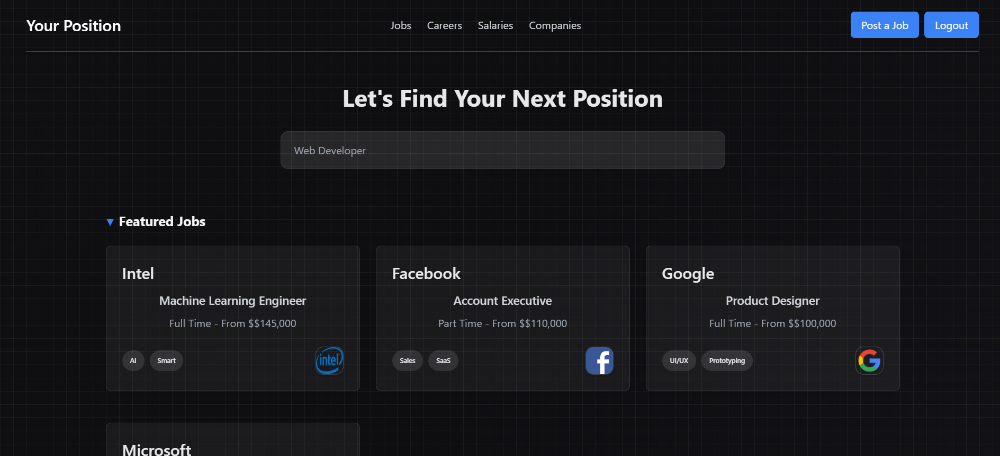

# Your Position - Job Posting Website

[LIVE VERSION LINK](LIVE_LINK)



## Description

**Your Position** is a job posting website built with Laravel 11. The platform allows users to explore job listings, search for specific positions, and view details on featured and regular jobs. Registered users have the option to post jobs, while non-registered visitors can browse through job postings without the need to create an account.

## Features

- **User Authentication & Authorization**: Users can register and log in. Only authenticated users can post jobs, while non-authenticated users can view job listings.
- **Job Posting**: Authenticated users can create and post jobs with detailed information, including job title, company name, salary, location, duration, and tags.
- **Featured Jobs & Tags**: Jobs are categorized as featured or regular, with tags for easy filtering and categorization.
- **Job Search**: Users can search for jobs using keywords to find relevant positions quickly.
- **Responsive Design**: A user-friendly, modern design optimized for desktop and mobile views.

## Tech Stack

- **Backend**: Laravel 11
- **Frontend**: Tailwind CSS and Blade components

## Key Components Used

- **Components**: Reusable Blade components for jobs, tags, forms, and layout.
- **Migrations**: Database migrations for creating tables like `jobs`, `users`, and `tags`.
- **Factories & Seeders**: Laravel factories and seeders are used to populate the database with dummy data for development and testing purposes.
- **Controllers**: MVC architecture with controllers handling requests and interactions between the frontend and backend.

## Installation

1. Clone the repository.
   ```bash
   git clone https://github.com/yourusername/yourposition.git
   cd yourposition


2. Install dependencies.
    ```bash
    composer install
    npm install
    npm run build

3. Configure your .env file.

    cp .env.example to .env and configure the necessary environment variables.

4. Generate an application key.
    ```bash
    php artisan key:generate

5. Run migrations and seeders.
    ```bash
    php artisan migrate --seed

6. Start the development server
    ```bash
    php artisan serve 
    npm run dev 
